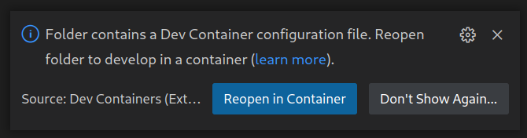
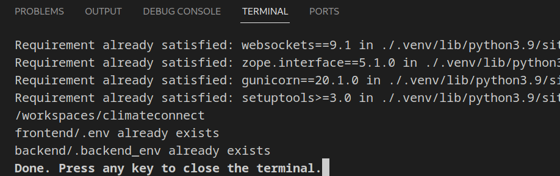

# Climate Connect

The client and server code for the web platform on https://climateconnect.earth.

# Development setup

Climate Connect depends on PostgreSQL/PostGIS and Redis.

We use Python/Django for our backend and Next.js for the frontend.

Note: we use Python 3, so for all instructions we assume `python` means `python3`.

Currently, our project is only compatible with python3.11.

First, clone the GitHub repository

```sh
git clone https://github.com/climateconnect/climateconnect
```

## One-click setup using VSCode Dev Containers

[VSCode Dev Containers](https://code.visualstudio.com/docs/devcontainers/containers) allow deploying a development environment including using Docker independent of the host operating system or installed programs.

Make sure you have the [Remote Development Extension Pack](https://marketplace.visualstudio.com/items?itemName=ms-vscode-remote.vscode-remote-extensionpack) VSCode extension installed.

1. Open the repo in VS Code
1. Start Docker (if it's not running)
1. Run the command "Reopen in Container"

   

1. Wait for it to be done setting up the Dev Container and running the setup scripts. This will take 1-5 minutes the first time and 10 seconds after that. It should look something like this:
   
1. Start the frontend dev server using `cd frontend && yarn dev`
1. Start the backend server using `cd backend && make start`. If you get a "Django is not installed" error run `Ctrl+Shift+P` (or `Cmd+Shift+P`) "Python: Select interpreter" -> Recommended so it uses the Python venv. Then reopen your vscode terminal to apply the change. `which python3` should show `backend/.venv/bin/python` now.
1. Open http://localhost:3000

You can get a Redis REPL using `redis-cli -h redis` and a PostgreSQL REPL using `psql`.

## Manual Setup

If you can't or don't want to use VS Code dev containers, follow the steps below.

### Postgres

1. Install Postgresql (https://www.postgresql.org/download/)
1. Create a local Postgres database with your own username and password. E.g., `createdb climateconnect-dev`.
1. Install [PostGIS](https://postgis.net/install/) on your local machine.
1. Create the PostGIS extension within that database: run [`CREATE EXTENSION postgis;`](https://docs.djangoproject.com/en/3.1/ref/contrib/gis/install/postgis/).

You will connect to this for your local backend project.

- Create a new superuser (run `CREATE USER username WITH SUPERUSER;`)
- Alter your new user's password (run `ALTER USER username WITH PASSWORD 'mypassword';`)
- Create a new database (run `CREATE DATABASE climateconnect OWNER username';`)

Supply these values to your local `backend/.backend_env` (see Project Dependencies->Backend->First Time Setup for more information).

### Docker

We use Docker to run the local Redis server. See the [Docker install docs](https://docs.docker.com/get-docker/) if you don't have it.

Make sure to install docker-ce, docker-ce-cli, containerd.io, and docker-compose.

## Project Dependencies

Make sure yarn (https://classic.yarnpkg.com/lang/en/docs/install/) and pdm (https://pdm.fming.dev/latest/#recommended-installation-method) are installed.
Run `./install_deps.sh` to install the JavaScript dependencies and the Python dependencies in a virtualenv.

### Backend

#### First Time Setup

1.  Go to backend directory: `cd backend`
1.  Run `make install` to install all backend libraries.
1.  Create `.backend_env` to set environment variables.
    - You can use the script [./initial_dev_setup.sh](./initial_dev_setup.sh) as inspiration.
    - You can find up-to-date sample env variables in [`backend/local-env-setup.md`](https://github.com/climateconnect/climateconnect/blob/master/backend/local-env-setup.md).
    - For the [Django `SECRET_KEY`](https://docs.djangoproject.com/en/3.1/ref/settings/#std:setting-SECRET_KEY), run `openssl rand -base64 32` to create a 32 char random secret.
1. Make sure that PostgreSQL accepts password authenticaiton for your local connections  (https://www.postgresql.org/docs/current/auth-pg-hba-conf.html). Therefore, change the METHOD to `scram-sha-256`.
1.  Run `make migrate` to run Django migrations.
    - _Note: This command is used for when you first start, or whenever you are adding or updating database models_.
1.  Create a superuser using `python manage.py createsuperuser`
    - You can then access your admin panel via <API_URL>/admin/ (e.g. http://localhost:8000/admin/)

#### Continual Development

1.  Ensure Docker is running and then run `sudo docker compose up`. This will start a Redis server on Docker.
1.  Ensure the Postgres server is running and the venv is activated.
1.  Run server using `make start`.
1.  Run Celery using `celery -A climateconnect_main worker -l INFO`

#### Creating and Removing Test Data

If test data is needed, run

```sh
python manage.py create_test_data --number_of_rows 4
```

If you need to wipe your local database and start over, run

```sh
sudo -u postgres psql  # note this might differ slightly in name based on your postgres setup
```

And then at the `psql` prompt,

```sql
postgres-# \list
```

to show available databases. Once you've identified the Climate Connect database name (e.g. we'll call it `$DATABASE_NAME`), you can,

```sql
postgres-# \connect $DATABASE_NAME
$DATABASE_NAME-# \dt
$DATABASE_NAME-# DROP SCHEMA public CASCADE;
$DATABASE_NAME-# CREATE SCHEMA public; # recreate schema
CREATE EXTENSION postgis; # readd postgis
ALTER SCHEMA public OWNER TO $YOUR_SUPER_USER; # make sure your superuser is the owner of the table
$DATABASE_NAME-# \q
```

Then run

```sh
make migrate
```

to update your migrations, and

```sh
python manage.py createsuperuser
```

to re-create a super user to be used in the Django admin panel.

#### Testing and Code Health

For unit tests, to run the test suite use:

```sh
make test
```

Or a specific test file or test class:

```sh
python manage.py test <file_path> or <file_path + class_name>
```

For linting, we use [ruff](https://ruff.rs). Lint with

```sh
make lint
```

For formatting, we use [Black](https://black.readthedocs.io/en/stable/usage_and_configuration/the_basics.html). Format a specific file with

```sh
make format path_to_file
```

or a directory with

```sh
make format directory
```

More configuration for Black can be found in the `pyproject.toml` file.

### Frontend

1. `cd frontend`.
1. `yarn` to download all npm packages.
1. Add a `.env` file for frontend environment variables. You can find variables you need to set in [`/frontend/next.config.js/`](https://github.com/climateconnect/climateconnect/blob/master/frontend/next.config.js).

For local development, use the following for `.env`:

```sh
API_HOST="localhost"
API_URL="http://127.0.0.1:8000"
BASE_URL_HOST="localhost"
SOCKET_URL="ws://localhost"
ENVIRONMENT="development"
CUSTOM_HUB_URLS="example"
LOCATION_HUBS=valu1,value2,value3
```

If you have a Webflow token, set it up in the .env with:
```sh
WEBFLOW_API_TOKEN="<myToken>"
WEBFLOW_SITE_ID="<siteID>"
ENABLE_DEVLINK="true"
```
otherwise just set ```ENABLE_DEVLINK``` to false.

_Note: This is for people who are using newer version of node (v17.0.1) or have new apple M1 devices. Before running `yarn dev`, please run this command `export NODE_OPTIONS=--openssl-legacy-provider`. You can save this in your `~/.zshrc` file as well._

And finally `yarn dev` to spin up the Next.js app! Check out our [frontend (FE) code style guidelines wiki](https://github.com/climateconnect/climateconnect/wiki/Frontend-Code-Style-Guide) to follow codebase best practices and contribute to a healthy and maintainable codebase.

#### Testing and Code Health

For unit tests, we use Jest. Write test files with `.test.js` and execute them directly with

```sh
yarn jest path/to/testfile.test.js
```

For linting, we use `eslint`. Watch files to fix lint issues with

```sh
yarn lint:watch
```

For formatting, we use `prettier`. Format with

```sh
yarn format
```

_See npm scripts in `package.json` for more._

You can analyze size of the (frontend) bundle with

```sh
yarn analyze-bundle
```

## Deploy

Currently the project is utilizing credits to deploy onto Azure. That deployment utilizes the two scripts in the root of the project, `start_backend.sh` and `start_frontend.sh`.

### Frontend

#### Option 1: GitHub Actions

1. Use GitHub actions to push to a server. A deploy file can be found in `.github/workflows`

#### Option 2: Manually

1. `cd frontend`
2. `yarn --production`
3. `yarn build`
4. `node server.js` OR `next start`

### Backend

1. Make sure your `ENVIRONMENT` env variable is set to `production` when deploying to the production server
2. Follow steps 1-5 of the "Getting started
   locally - backend" (above in this file)
