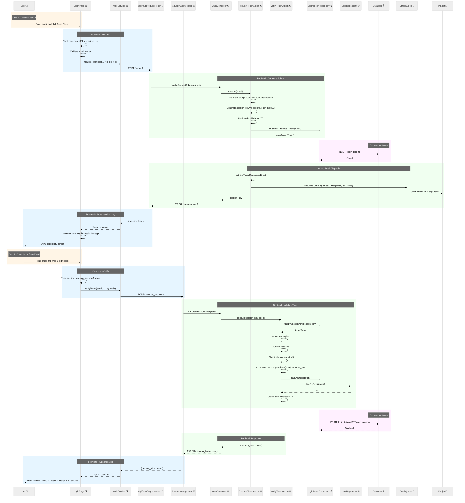

# Passwordless Login Flow (Email OTP / Magic Token)

**Version**: 1.0.0  
**Last Updated**: 2026-04-15  
**Stack Context**: Next.js frontend · Django REST Framework backend · Mailjet email · Redis/Celery async

---

## Overview

A **passwordless login** using an emailed token (also called a *magic code* or *OTP — One-Time Password*) lets a user authenticate without ever setting or entering a password. The user provides their email address, receives a short-lived token by email, enters it on the same page that requested it, and is granted a session.

This document maps out the full flow, the security model behind it, and the best-practice rules that must be enforced.

---

## Key Concepts

| Concept | Description |
|---|---|
| **OTP / Magic Token** | A cryptographically random, short-lived code (typically 6–8 digits or a 32-byte hex string) sent to the user's email. |
| **Session Binding** | The token is tied to the *browser session* (or a server-side session key) that requested it, so it cannot be redeemed from a different browser/device. |
| **Single-Use** | Once a token is successfully validated it is immediately invalidated and cannot be reused. |
| **Time-Limited** | Tokens expire after a short window (recommended: **15 minutes**). |
| **Rate Limiting** | Token generation and validation attempts are rate-limited to prevent brute-force and email flooding. |

---

## Why OTP Code — Not a Magic Link

A common alternative is to email a **magic link** (a URL containing the token). This approach is explicitly **not used here** for the following reasons:

| Problem | Detail |
|---|---|
| **Wrong browser** | Clicking a link in an email client opens the system default browser, which may not be the browser the user was already using on the site. |
| **New window / tab** | Even if the same browser opens, the link opens a *new* tab — the user's original tab (with their intended destination) is abandoned. |
| **Lost redirect context** | The page the user was trying to reach before being prompted to log in (`redirect_url`) lives in the original tab's state. A magic link in a new tab has no access to it. |
| **Session binding breaks** | The `session_key` that ties the token to the originating browser context cannot be reliably transferred via a URL click across different browser windows or devices. |

**The OTP code pattern solves all of these**: the user stays on the same page, in the same tab, in the same browser. The `redirect_url` is preserved in the page's state and the user is sent there immediately after successful verification.

---

## Data Model

### `LoginToken` entity

```
LoginToken
├── id              UUID (PK)
├── user_id         FK → User (nullable — set after lookup)
├── email           String  — the address the token was sent to
├── token_hash      String  — bcrypt/SHA-256 hash of the raw token (never store plaintext)
├── session_key     String  — random key issued to the browser at request time
├── expires_at      DateTime — now + 15 minutes
├── used_at         DateTime (nullable) — set on first successful use
├── attempt_count   Integer (default 0) — failed validation attempts
├── created_at      DateTime
```

**Rules:**
- Only one *active* (unused, non-expired) `LoginToken` per email at a time. Creating a new one invalidates the previous one.
- `token_hash` stores a hash of the raw token — the raw value is only ever held in memory and sent by email.
- `session_key` is a random value generated server-side and returned to the browser in the response to the token-request call. It is stored in the browser's `sessionStorage` (not `localStorage`) so it is tab-scoped and disappears when the tab closes.
- After **5 failed attempts** the token is invalidated and the user must request a new one.

**Token retention after use:**
- Used tokens (`used_at IS NOT NULL`) are **kept in the database for 24 hours** after use, then deleted by the cleanup task. This provides a short audit window for debugging and security investigations.
- Expired, unused tokens are deleted after **1 hour** past their `expires_at` (i.e. `expires_at + 1 hour < now`).
- The `used_at` timestamp is the authoritative single-use guard — a token with `used_at IS NOT NULL` is always rejected, regardless of retention.
- The raw code is never stored, so retained records contain no sensitive material beyond the hash.

### `LoginAuditLog` entity (optional — recommended)

A separate audit log table records every login attempt for security monitoring and abuse detection. This is distinct from `LoginToken` (which is operational and short-lived) — audit logs are retained longer and are append-only.

```
LoginAuditLog
├── id              UUID (PK)
├── email           String  — the email address used in the attempt
├── user_id         FK → User (nullable — null if email not found)
├── outcome         Enum: requested / verified / failed / expired / exhausted / resent
├── ip_address      String (nullable) — see privacy note below
├── user_agent      String (nullable) — see privacy note below
├── created_at      DateTime
```

**Outcomes:**
- `requested` — token generation request received (email may or may not exist)
- `verified` — token successfully validated, session issued
- `failed` — wrong code submitted (increments attempt_count)
- `expired` — validation attempted on an expired token
- `exhausted` — validation attempted after 5 failed attempts
- `resent` — resend requested (previous token invalidated, new one issued)

**Privacy considerations (GDPR):**
- IP addresses and user-agent strings are **personal data** under GDPR. Storing them requires a lawful basis (legitimate interest for security is generally accepted, but must be documented in the privacy policy).
- If stored, IP addresses should be **anonymized** (e.g. last octet zeroed for IPv4: `192.168.1.x`) or stored only in hashed form to reduce the privacy footprint while retaining abuse-detection utility.
- Audit logs should be retained for a defined period (e.g. **90 days**) and then automatically purged.
- Users should be able to see their own login history (see "Last Login Display" below) but not the raw IP data of others.

**Abuse detection use cases:**
- Many `failed` outcomes for the same email in a short window → brute-force attempt
- Many `requested` outcomes from the same IP for different emails → credential stuffing / enumeration attempt
- `verified` outcome from an unexpected location → potential account takeover

---

## Last Login Display

Django's [`User.last_login`](https://docs.djangoproject.com/en/stable/ref/contrib/auth/#django.contrib.auth.models.User.last_login) is automatically updated on every successful authentication. This field should be surfaced to the user in their account/profile settings page as a security transparency feature.

**Recommended display:**
- Show the timestamp of the last successful login: *"Last login: April 13, 2026 at 14:32 (Berlin)"*
- Optionally show the **previous** last login (i.e. the one before the current session) so the user can detect if someone else logged in since they last used the account.

**Implementation note:** To show the *previous* last login, capture `user.last_login` before calling `update_last_login()` (or Django's `login()`) and store it temporarily in the session or return it in the verify-token response alongside `access_token`.

---

## Flow Description

### Step 0 — Email lookup (combined login/signup entry point)

1. User arrives at `/login` and enters their email address.
2. Frontend sends `POST /api/auth/check-email` with `{ email }`.
3. Backend looks up the `User` by email and reads `UserProfile.auth_method` (field added in the same migration as `LoginToken`; migration default: `password` for all existing users).
4. Backend returns `{ user_status }` — one of:
   - `"new"` — email not found → frontend routes to the signup sub-flow.
   - `"returning_password"` — user exists and `auth_method = "password"` → frontend shows the password form; OTP path is available as an opt-in via "Use a code instead".
   - `"returning_otp"` — user exists and `auth_method = "otp"` → frontend proceeds directly to Step 1 below.
5. `check-email` intentionally reveals whether an email is registered (necessary for routing). This is an accepted trade-off; IP-based rate limiting (`20/h` via `django-ratelimit`) is the mitigation.

> **Note**: for users who choose "Use a code instead" from the password form (`returning_password`), the frontend skips the password step and proceeds to Step 1.

### Step 1 — User requests a token

1. User is on a protected page (e.g. `/projects/123/join`) and is prompted to log in. The frontend captures the current URL as `redirect_url` before showing the login form.
2. User has already provided their email in Step 0; `check-email` has confirmed they are OTP-eligible.
3. Frontend sends `POST /api/auth/request-token` with `{ email }`.
4. Backend:
   b. Looks up the `User` by email (if not found, still returns success to prevent user enumeration).
   c. Generates a **cryptographically random** 6-digit code (e.g. `secrets.randbelow(1_000_000)` in Python, zero-padded to 6 digits).
   d. Generates a **random `session_key`** (e.g. 32-byte hex string via `secrets.token_hex(32)`).
   e. Hashes the raw code with SHA-256 (or bcrypt for extra safety).
   f. Saves a `LoginToken` record: `{ email, token_hash, session_key, expires_at = now+15min }`.
   g. Invalidates any previous active token for this email.
   h. Enqueues an email via Mailjet (Celery task) with the raw 6-digit code.
   i. Returns `{ session_key }` to the frontend (HTTP 200).
5. Frontend stores `session_key` in `sessionStorage` (alongside `redirect_url`, which was captured from the page URL before the login form was shown) and transitions to the **code entry screen** (same page, different UI state — no navigation, no URL change).

### Step 2 — User receives and enters the code

1. User opens their email client, reads the 6-digit code.
2. User returns to the browser tab (same tab, same page) and types the code.
3. Frontend sends `POST /api/auth/verify-token` with `{ session_key, code }`.
   - `session_key` is read from `sessionStorage`.

### Step 3 — Backend validates the token

1. Backend looks up the `LoginToken` by `session_key`.
2. Checks:
   - Record exists.
   - `expires_at > now` (not expired).
   - `used_at IS NULL` (not already used).
   - `attempt_count < 5` (not brute-forced out).
3. Hashes the submitted `code` and compares to `token_hash` using a **constant-time comparison** (prevents timing attacks).
4. On **mismatch**: increments `attempt_count`, returns `401 Unauthorized`. If `attempt_count` reaches 5, marks the token as exhausted.
5. On **match**:
   - Sets `used_at = now` (invalidates the token).
   - Looks up the `User` by `email`.
   - Issues a Django session (or JWT) for the user.
   - Returns `{ access_token, user }` (HTTP 200).
6. Frontend stores the session/token, reads `redirect_url` from `sessionStorage`, and navigates there (or `/dashboard` if absent). Because the user never left the original tab, this navigation happens in the same browser context where they started.

---

## Resend Flow

Users sometimes don't receive the email (spam filter, slow delivery) or the code expires before they enter it. The "Resend code" action must be handled carefully.

### What happens on resend

1. User clicks "Resend code" on the code entry screen.
2. Frontend calls `POST /api/auth/request-token` again with the **same `{ email }`** payload.
3. Backend:
   a. Applies rate limiting — if the email has already received a code within the last **60 seconds**, return `429 Too Many Requests` with a `Retry-After` header. This prevents accidental double-sends and abuse.
   b. Invalidates the previous `LoginToken` for this email (sets `used_at = now` or deletes it — either approach works; marking it used is cleaner for audit).
   c. Generates a **new** 6-digit code and a **new `session_key`**.
   d. Saves a new `LoginToken` record.
   e. Sends a new email via Mailjet.
   f. Returns `{ session_key }` (HTTP 200).
4. Frontend **replaces** the `session_key` in `sessionStorage` with the new value. The code entry field is cleared and a confirmation message is shown ("A new code has been sent").

### Key design decisions

| Decision | Rationale |
|---|---|
| **New `session_key` on every resend** | The old `session_key` is now invalid (its token was invalidated). Issuing a new one keeps the session binding consistent and prevents the old code from being used after a resend. |
| **Old token invalidated immediately** | Prevents a race condition where both the old and new codes are valid simultaneously. Only one active token per email at any time. |
| **60-second cooldown** | Prevents accidental double-clicks and limits email flooding. The frontend should also disable the "Resend" button for 60 seconds after each send and show a countdown. |
| **Rate limit is per email, not per session** | An attacker cannot bypass the cooldown by opening a new tab and starting a fresh session for the same email. |

### Frontend UX pattern

```
[Email entry screen]
  → User submits email
  → Transition to [Code entry screen]
     - "Resend code" button (disabled for 60s, shows countdown)
     - On click: call request-token again, update session_key in sessionStorage, clear code field
     - Show: "A new code has been sent to your email."
```

---

## Sequence Diagram



---

## Why Session Binding Matters

The `session_key` is the critical security mechanism that ties the token to the **specific browser tab** that requested it.

```
Without session binding:
  Attacker intercepts email → enters code on attacker's device → logs in ✗

With session binding:
  Attacker intercepts email → enters code on attacker's device
  → backend checks session_key (attacker doesn't have it) → 401 ✓
```

The `session_key` is:
- Generated server-side (not guessable).
- Returned only in the HTTP response body (not in the email).
- Stored in `sessionStorage` (tab-scoped, not persisted across tabs or browser restarts).
- Never logged or exposed in URLs.

---

## Security Best Practices

### Token Generation
- Use a **cryptographically secure random number generator** (`secrets` module in Python, `crypto.randomBytes` in Node.js). Never use `random.randint` or `Math.random()`.
- For 6-digit codes: `str(secrets.randbelow(1_000_000)).zfill(6)` — gives uniform distribution across 000000–999999.

### Token Storage
- **Never store the raw token** in the database. Store only a hash (`hashlib.sha256(token.encode()).hexdigest()`).
- For extra protection against database compromise, use bcrypt (slower but resistant to GPU cracking).

### Token Validation
- Use **constant-time comparison** (`hmac.compare_digest` in Python) to prevent timing attacks.
- Validate `expires_at` before comparing the hash.
- Increment `attempt_count` on every failed attempt and lock after 5 failures.

### Rate Limiting

**Library**: `django-ratelimit` (backed by Redis). See the full rate limiting strategy in [`EPIC_auth_unification.md`](../../spec/EPIC_auth_unification.md#rate-limiting-strategy-phase-a).

- **`check-email`**: `20/h` per IP — IP-based only (email existence is intentionally revealed here).
- **`request-token`**: `3/10m` per email + `30/h` per IP as secondary layer.
- **`verify-token`**: DB-enforced via `attempt_count` (5 attempts → token locked); no `django-ratelimit` decorator needed.
- All rate-limited views return `HTTP 429` with a `Retry-After` header.

### Token Lifetime
- **15 minutes** is the recommended expiry for OTP codes.
- Expired tokens should be cleaned up by a periodic Celery task (see token retention rules in the Data Model section above).

### User Enumeration Prevention
- The `POST /api/auth/request-token` endpoint **always returns HTTP 200**, even if the email is not registered. This prevents attackers from discovering which emails have accounts.
- The email is simply not sent if the user doesn't exist (or a "no account found" email can be sent instead, which is also a valid UX pattern).

### HTTPS Only
- All endpoints must be served over HTTPS. The `session_key` and token are sensitive values that must not travel over plain HTTP.

### Security Ceiling — Email as the Trust Anchor

The security of this entire flow is bounded by the security of the user's email account. This is the same trust anchor used by **password reset flows** — if an attacker controls the user's inbox, they can log in. This is an accepted industry trade-off for passwordless authentication.

The key difference from a password reset is that **every login generates a visible email notification**. This means:
- The user is always notified of login attempts, even ones they didn't initiate.
- Unauthorized access attempts are immediately visible to the account owner.
- There is no silent credential theft (unlike a stolen password that can be used indefinitely without the user knowing).

This "leaves a trail" property is actually a security advantage: it makes account takeover detectable and creates an audit record of all login activity.

### Redirect URL Handling

`redirect_url` is captured by the frontend from the page URL before the login form is shown and stored in `sessionStorage` alongside `session_key`. It is **never sent to the backend**. After `verify-token` succeeds, the frontend reads `redirect_url` from `sessionStorage` and navigates there (or to `/` if absent).

This eliminates server-side open redirect risk entirely. Since session binding (`session_key` in tab-scoped `sessionStorage`) already prevents cross-device OTP redemption, there is no scenario where the server needs to hold the redirect URL.

### Email Security
- The email should contain:
  - The 6-digit code prominently.
  - A clear statement that the code expires in 15 minutes.
  - A note that the user did NOT request this if they didn't initiate it.
  - **No clickable login link** — the user must return to the browser tab and type the code. This is intentional: it keeps the session binding intact and avoids all the problems described in the "Why OTP Code — Not a Magic Link" section.

---

## Error States & User Messaging

| Scenario | HTTP Status | User Message |
|---|---|---|
| Email not found | 200 | "If an account exists, a code has been sent." |
| Code incorrect | 401 | "Invalid code. X attempts remaining." |
| Code expired | 401 | "This code has expired. Please request a new one." |
| Code already used | 401 | "This code has already been used. Please request a new one." |
| Too many attempts | 429 | "Too many failed attempts. Please request a new code." |
| Rate limit on request | 429 | "Please wait before requesting another code." |
| Session key mismatch | 401 | "Invalid session. Please start the login process again." |
| Resend too soon | 429 | "Please wait X seconds before requesting a new code." |

---

## Implementation Checklist

- [ ] `UserProfile.auth_method` field (`password` / `otp`; migration default: `password` for all existing users)
- [ ] `POST /api/auth/check-email` — accepts `{ email }`, reads `UserProfile.auth_method`, always returns HTTP 200 with `{ user_status: "new" | "returning_password" | "returning_otp" }`; rate-limited `20/h` per IP via `django-ratelimit`
- [ ] `LoginToken` model with `token_hash`, `session_key`, `redirect_url`, `expires_at`, `used_at`, `attempt_count`
- [ ] `POST /api/auth/request-token` — accepts `{ email }`, generates token, returns `{ session_key }` — also serves as the **resend** endpoint (invalidates previous token, issues new `session_key`, enforces 60s cooldown per email)
- [ ] `POST /api/auth/verify-token` — validates `(session_key, code)`, issues session, returns `{ access_token, user }`
- [ ] Celery task: `SendLoginCodeEmail` via Mailjet
- [ ] Celery beat task: `CleanupLoginTokens` — deletes used tokens older than 24h and expired unused tokens older than 1h past expiry (runs every 30 minutes)
- [ ] Rate limiting via `django-ratelimit`: `20/h` per IP on `check-email`; `3/10m` per email + `30/h` per IP on `request-token`; DB `attempt_count` (no decorator) on `verify-token`
- [ ] Frontend: `sessionStorage` for `session_key` and `redirect_url` (captured from page URL before login form is shown); single-page state machine (email entry → code entry → authenticated → navigate to `redirect_url`)
- [ ] Frontend: "Resend code" button on code entry screen — disabled for 60s with countdown, updates `session_key` in `sessionStorage` on success, clears code input field
- [ ] Constant-time comparison (`hmac.compare_digest`) in token validation
- [ ] User enumeration protection on request endpoint (always HTTP 200)
- [ ] `redirect_url` stored in `sessionStorage` only — never sent to backend; no server-side open redirect validation needed
- [ ] Email template with expiry notice and "didn't request this?" copy — no clickable login link
- [ ] `LoginAuditLog` model — append-only, records all outcomes (requested / verified / failed / expired / exhausted / resent)
- [ ] Write audit log entry on every token request and verification attempt
- [ ] Celery beat task: `CleanupLoginAuditLogs` — purge entries older than 90 days
- [ ] Account settings page: display `User.last_login` and optionally the previous last login (captured before `update_last_login()` is called)
- [ ] Privacy policy: document audit log retention, IP anonymization policy, and lawful basis (legitimate interest for security)

---

## Related Documents

- [`system-entities.md`](../entities/system-entities.md) — User and identity data models
- [`core-flows.md`](./core-flows.md) — Other authentication and onboarding flows
- [`architecture_overview.md`](../architecture_overview.md) — Technical stack (Django, Mailjet, Redis/Celery)
