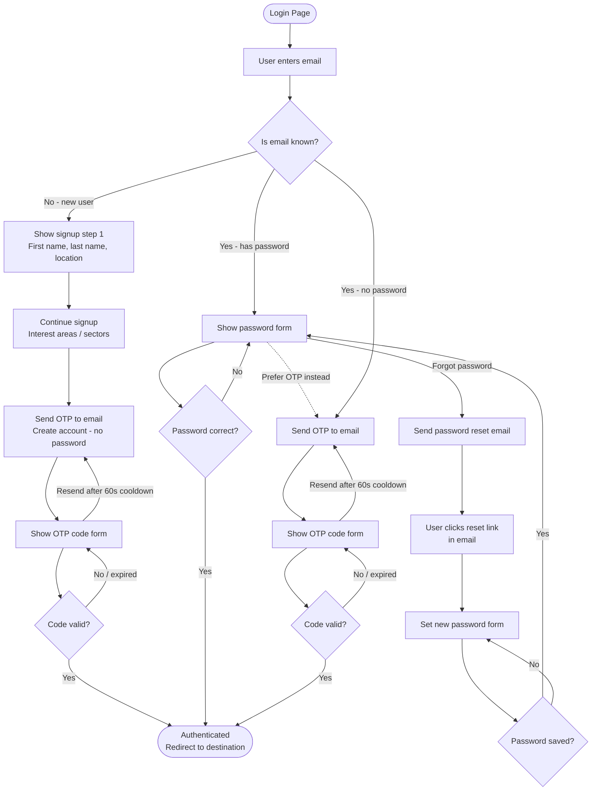

# EPIC: Auth Unification

**Type**: Epic  
**Status**: PLANNED  
**Started**: —  
**Owner**: CC  
**Depended on by**: [EPIC: Event Registration](./EPIC_event_registration.md) — Phase 3 (guest registration) cannot ship until Phase A of this epic is complete.

---

## Overview

This epic simplifies and unifies the platform's authentication experience. Today, login and signup are two separate pages with separate flows, and all accounts require a password. This epic delivers:

1. **A combined login/signup entry point** — one page where users enter their email and the platform branches automatically: returning users proceed to login, new users proceed to signup. No upfront choice between two separate pages.
2. **OTP-based (passwordless) login as the default** — instead of a password, the platform emails a **6-digit one-time code** to the user. The user enters it on the same page and in the same browser tab. New accounts are created without a password by default. This significantly reduces friction and eliminates the most common support issue (forgotten passwords). **Magic links are explicitly not used** — they open a new browser tab, losing the original redirect context and breaking session binding.
3. **Password as an opt-in setting** — existing users keep their passwords and can continue using them. Any user can set or change a password and toggle between OTP-based and password-based login from their account settings.

The primary driver for this epic is enabling **guest event registration**: a visitor who wants to register for an event must be able to create a platform account as part of the registration flow without the friction of a password. This epic is the prerequisite.

> **Full technical design for the OTP flow** (data model, security rules, sequence diagram, implementation checklist) is documented in [`doc/mosy/flows/passwordless-login-flow.md`](../mosy/flows/passwordless-login-flow.md). Per-story specs reference that document directly. This epic captures the scope, story breakdown, and constraints.

---

## Current System (as of April 2026)

Understanding what exists is essential before changing it.

### Frontend

| Page | URL | Description |
|------|-----|-------------|
| Sign in | `/signin` | Single-step form: email + password. Supports `?redirect=` and `?hub=` params. Calls `POST /login/`. |
| Sign up | `/signup` | Three-step wizard: (1) email + password, (2) first/last name + location, (3) interest areas/sectors. Calls `POST /signup/`. Supports `?redirect=` and `?hub=` params. |
| Account created | `/accountcreated/` | Intermediate page shown after signup; informs user a verification email was sent. |
| Reset password | `/resetpassword` | Sends password reset email via `/api/send_reset_password_email/`. |

Hub theming (custom colours, header images) is applied to both `/signin` and `/signup` via `?hub=` query param using `getHubTheme()` and `transformThemeData()`.

### Backend

| Endpoint | Method | Description |
|----------|--------|-------------|
| `POST /login/` | POST | Extends Knox `LoginView`. Authenticates with `username` (email) + `password`. Returns `{token, expiry}`. Checks `is_profile_verified` before allowing login. |
| `POST /signup/` | POST | Creates `User` and `UserProfile`. Required fields: `email`, `password`, `first_name`, `last_name`, `location`, `send_newsletter`, `source_language`. Sends verification email (unless `AUTO_VERIFY=True`). |
| `POST /logout/` | POST | Knox `LogoutView`. |
| `POST /api/send_reset_password_email/` | POST | Initiates password reset flow. |
| `POST /api/set_new_password/` | POST | Completes password reset. |
| `POST /api/verify_profile/` | GET | Activates account from verification email link. |
| `POST /api/resend_verification_email/` | POST | Resends account verification email. |
| `PATCH /api/account_settings/` | PATCH | Updates account settings (email, password, notifications). |

**Auth token mechanism**: Django REST Knox — tokens stored as `AuthToken` records, returned as `{token, expiry}`, stored in cookies on the frontend via `signIn()` in `UserContext`.

### Key constraints for any changes

- **Backward compatibility is non-negotiable**: existing users with passwords must be able to log in without any migration or forced re-authentication.
- **Hub theming must be preserved**: the combined page must support `?hub=` and apply custom themes exactly as today.
- **`?redirect=` param must work end-to-end**: used by any feature that requires authentication before completing an action (e.g. following a project, commenting). After login/signup, the user is sent to the URL in `?redirect=`.
- **Knox tokens stay**: the token mechanism does not change. Only *how* a user authenticates to obtain a token changes.
- **`AUTO_VERIFY` setting**: staging/dev environments use `AUTO_VERIFY=True` to skip verification emails. This must continue to work with the new flow.

---

## Phases

### 🎯 Phase A — Combined Flow + OTP Login (MVP · go-live enabler)

This phase is the prerequisite for Event Registration Phase 3. All stories must be complete and validated on staging before the `EVENT_REGISTRATION` toggle is flipped to production.

> **Full technical design** (LoginToken data model, rate limiting, security rules, Celery tasks, sequence diagram) is in [`doc/mosy/flows/passwordless-login-flow.md`](../mosy/flows/passwordless-login-flow.md).

#### Tech Enablers (sequential — each unblocks the next)

| #                                                              | Story | Notes | Status |
|----------------------------------------------------------------|-------|-------|--|
| [US-1](./20260420_1200_auth_unification_us1_feature_toggle.md) | `AUTH_UNIFICATION` feature toggle | Add `AUTH_UNIFICATION` to `FeatureToggle` using the existing pattern. Wire `/signin` and `/signup` to redirect to `/login` when on. No UI changes yet — just the toggle and redirect. Unblocks parallel frontend/backend work behind the flag. | ✅ |
| [US-2](./20260420_1215_auth_unification_us2_data_layer.md)     | `LoginToken`, `LoginAuditLog` models + `UserProfile.auth_method` | Django models + migrations per data model spec below. Include `CleanupLoginTokens` (every 30 min) and `CleanupLoginAuditLogs` (purge >90 days) Celery beat tasks. Also add `auth_method` field to `UserProfile` (values: `password` / `otp`; migration default: `password` — safe for all existing users). Pure data layer — no endpoints yet. Adding `auth_method` here means the frontend login flow (US-5/US-7) can read the correct auth method from day one, and US-10/US-11 can be worked on in parallel without waiting for a later model change. | ✅ |
| [US-2b](./20260420_1230_auth_unification_us2b_check_email.md)  | `POST /api/auth/check-email` endpoint | Accepts `{ email }`. Looks up user, checks `has_usable_password()`. Always returns HTTP 200. Returns `{ user_status: "new" \| "returning_password" \| "returning_otp" }`. Rate-limited per IP. **Enumeration trade-off**: unlike `request-token`, this endpoint intentionally reveals whether an email is registered — necessary for routing. This is an accepted trade-off in combined login/signup flows; rate limiting per IP is the mitigation. No enumeration defence (always-200 body hiding) applies here. | ✅ |
| [US-3](./20260420_1245_auth_unification_us3_request_token.md)  | `POST /api/auth/request-token` endpoint | Accepts `{ email }`. Generates OTP (`secrets.randbelow`) and `session_key` (`secrets.token_hex(32)`), stores hash only. Invalidates previous active token. Enqueues `SendLoginCodeEmail` Celery task (Mailjet) with raw code. Always returns HTTP 200 + `{ session_key }` (user enumeration prevention). Rate limiting: 3 req/email/10 min; 60s resend cooldown (same endpoint, issues new `session_key`). Writes to `LoginAuditLog` on every call. **New-user note**: in the combined flow, new users always go through `POST /signup/` before `request-token` is called (US-8), so the user will exist in the DB by the time this endpoint is hit. The nullable `user_id` on `LoginToken` is a safety net for the enumeration-prevention case only, not a new-user signup path. | 📋 |
| US-4                                                           | `POST /api/auth/verify-token` endpoint | Accepts `{ session_key, code }`. Validates: not expired, not used, `attempt_count < 5`, constant-time hash compare (`hmac.compare_digest`). On failure: increment `attempt_count`, return 401 with message; lock at 5. On success: mark `used_at`, issue Knox `{token, expiry}`, return `{ token, expiry, user }`. Frontend reads `redirect_url` from its own `sessionStorage` and navigates. Writes to `LoginAuditLog` on every call (all outcomes). | ⚪ |

#### Frontend (US-7 and US-8 can be built in parallel once US-5 is done)

| # | Story | Notes | Status |
|---|-------|-------|--------|
| US-5 | Combined auth page — email entry step | New page at `/login` (behind toggle). Email form calls `POST /api/auth/check-email`. Transitions page state based on `user_status` — no navigation, no URL change. Supports `?hub=` theming (`getHubTheme()` in `getServerSideProps`, same as today) and `?redirect=` param. Old `/signin` and `/signup` redirect here when toggle is on. *Depends on US-2b.* | ⚪ |
| US-6 | OTP code entry + resend | Step 2 UI state on `/login`: 6-digit code input calls `POST /api/auth/verify-token`. On success: call `signIn()` in `UserContext`, read `redirect_url` from `sessionStorage` and redirect (or home if absent). "Resend" button: 60s disabled countdown, re-calls `request-token`, updates `session_key` in `sessionStorage`, clears input. Error messages per spec (attempts remaining, expired, session mismatch). *Depends on US-3, US-4, US-5.* | ⚪ |
| US-7 | Password login option (backward compatibility) | **Parallelisable with US-8.** If `check-email` returns `returning_password`, show password field. Calls existing `POST /login/` — no change to that endpoint. Include a "Forgot password?" link to the existing `/resetpassword` page — no changes to the reset password flow. "Use a code instead" link transitions to OTP flow (calls `request-token`, then shows US-6). *Depends on US-2b, US-3, US-5.* | ⚪ |
| US-8 | New user signup within combined flow | **Parallelisable with US-7.** If `check-email` returns `new`, collect first/last name, location, then interest sectors (same fields as today's `/signup`). Call `POST /signup/` adapted to not require password — account is created unverified, same as today. Then trigger OTP via `request-token`; successful `verify-token` marks the account verified (OTP entry replaces the email link click). No separate verification email sent. *Depends on US-3, US-4, US-5.* | ⚪ |

#### Post-launch cleanup (after `AUTH_UNIFICATION` toggle is flipped globally)

| # | Story | Notes | Status |
|---|-------|-------|--------|
| US-A-cleanup | Remove legacy auth pages and toggle | Delete `/signin` and `/signup` pages, their components, and any code paths that only exist to support the old flow. Remove the `AUTH_UNIFICATION` `FeatureToggle` record and all toggle checks. Remove the now-redundant redirects added in US-1. Delete `POST /login/` if password login has been fully absorbed into the combined flow (confirm first). | ⚪ |

### 🔧 Phase B — Password Management in Settings

Post-Phase A. Allows users to manage their auth method after account creation.

| # | Story | Notes                                                                                                                                                                                                                                                                                                                                                | Status |
|---|-------|------------------------------------------------------------------------------------------------------------------------------------------------------------------------------------------------------------------------------------------------------------------------------------------------------------------------------------------------------|--------|
| US-9 | Expose `auth_method` via account settings API | `UserProfile.auth_method` is already in the DB (added in US-2). This story exposes it via `PATCH /api/account_settings/` and returns it in the account settings serializer. No model change needed — US-10 and US-11 can be started in parallel once US-2 is done. | ⚪ |
| US-10 | Set / change password from account settings | Update the existing change-password form: check `has_usable_password()` on the authenticated user. If no password is set, omit the current-password field (OTP-only users just enter and confirm the new password). If a password exists, keep the current-password confirmation as today. Backend validates accordingly and calls `set_password()`. | ⚪ |
| US-11 | Toggle between OTP-based and password-based login | Toggle in account settings UI backed by `auth_method`. If switching to password and none set yet, prompt to set one first (links to US-10).                                                                                                                                                                                                          | ⚪ |
| US-12 | Wire password login to `LoginAuditLog` | Extend `POST /login/` to write a `LoginAuditLog` entry on every attempt (success → `verified`, wrong password → `failed`). Makes login history complete across both auth methods and enables unified abuse detection queries on the audit table. | ⚪ |

---

## Shared Architecture Notes

> ⚠️ **Implementation details belong in per-story specs and the system architect review.** This section records entities, endpoints, and constraints that are known from the technical design doc so agents don't have to rediscover them.

### New Entities (Phase A)

#### `LoginToken`

| Field | Type | Notes |
|-------|------|-------|
| `id` | UUID | PK |
| `user_id` | FK → User, nullable | Set after lookup; null while email is unrecognised |
| `email` | String | Address the code was sent to |
| `token_hash` | String | SHA-256 (or bcrypt) hash of the raw 6-digit code — raw code never stored |
| `session_key` | String | 32-byte hex random value; ties the token to the specific browser tab |
| `expires_at` | DateTime | `now + 15 minutes` |
| `used_at` | DateTime, nullable | Set on first successful use — authoritative single-use guard |
| `attempt_count` | Integer | Default 0; incremented on each failed verify; token locked at 5 |
| `created_at` | DateTime | Auto |

**Key rules**: one active token per email at a time (new request invalidates previous); raw code held in memory only, never persisted; `session_key` returned to browser and stored in `sessionStorage` (tab-scoped).

**Retention**: used tokens kept 24h after use then deleted; expired unused tokens deleted 1h past `expires_at`. Both handled by a `CleanupLoginTokens` Celery beat task (runs every 30 min).

#### `LoginAuditLog`

Append-only audit table for security monitoring. Separate from `LoginToken` (which is operational and short-lived).

| Field | Type | Notes |
|-------|------|-------|
| `id` | UUID | PK |
| `email` | String | Email used in the attempt |
| `user_id` | FK → User, nullable | Null if email not found |
| `outcome` | Enum | `requested` / `verified` / `failed` / `expired` / `exhausted` / `resent` |
| `ip_address` | String, nullable | Anonymised (last octet zeroed for IPv4) — GDPR |
| `user_agent` | String, nullable | GDPR — optional |
| `created_at` | DateTime | Auto |

**Retention**: entries purged after 90 days by `CleanupLoginAuditLogs` Celery beat task.  
**GDPR**: IP addresses must be anonymised; retention period and lawful basis (legitimate interest / security) must be documented in the privacy policy.  
**Scope note**: Phase A logs OTP flow events only (`requested` / `verified` / `failed` / `expired` / `exhausted` / `resent`). Password-based login (via `POST /login/`) will be wired to write audit log entries in Phase B, giving a unified login history across both auth methods.

### New API Endpoints (Phase A)

| Endpoint | Method | Notes |
|----------|--------|-------|
| `POST /api/auth/check-email` | POST | Accepts `{ email }`. Looks up user and checks `has_usable_password()`. Always returns HTTP 200. Returns `{ user_status: "new" \| "returning_password" \| "returning_otp" }`. Rate-limited per IP. **Note**: intentionally reveals whether an email is registered — accepted trade-off for routing in a combined login/signup flow; rate limiting is the mitigation (unlike `request-token`, no body-level enumeration hiding applies here). |
| `POST /api/auth/request-token` | POST | Accepts `{ email }`. Always returns HTTP 200 (user enumeration prevention). Returns `{ session_key }`. Also serves as the **resend** endpoint — enforces 60s cooldown per email, invalidates previous token, issues new `session_key`. |
| `POST /api/auth/verify-token` | POST | Accepts `{ session_key, code }`. Validates expiry, single-use, attempt count, constant-time hash comparison. On success: marks token used, issues Knox `{token, expiry}`, returns `{ token, expiry, user }`. Frontend reads `redirect_url` from `sessionStorage` and navigates. |

### `UserProfile` changes (Phase A — added in US-2)

- `auth_method` field (values: `password` / `otp`; migration default: `password`). Added in US-2 alongside the `LoginToken`/`LoginAuditLog` models so that the login flow (US-5/US-7) and settings stories (US-10/US-11) can all read it from day one without a later model migration blocking them. Exposed via API in Phase B US-9.

### Rate Limiting Strategy (Phase A)

**Library**: [`django-ratelimit`](https://django-ratelimit.readthedocs.io/) — added as a new dependency. Chosen over DRF's built-in throttling because `request-token` requires per-email keying (not just per-IP), and using one consistent library across all three auth endpoints is simpler than mixing two approaches. Backed by Redis (already in the stack).

| Endpoint | Key | Limit | Notes |
|---|---|---|---|
| `POST /api/auth/check-email` | IP | `20/h` | Enumeration is IP-driven; per-email key adds nothing here |
| `POST /api/auth/request-token` | `post:email` | `3/10m` | Prevents email flooding per address |
| `POST /api/auth/request-token` | IP (secondary) | `30/h` | Catch distributed enumeration across many email addresses |
| `POST /api/auth/verify-token` | DB `attempt_count` | 5 attempts → locked | DB-enforced: survives Redis flush, persists across restarts; no `django-ratelimit` decorator needed on this endpoint |

**429 handling**: `block=True` on all decorators raises `Ratelimited`. Views catch it and return `HTTP 429` with a `Retry-After` header.

**`verify-token` note**: the DB-level `attempt_count` lock on `LoginToken` is the primary and sufficient guard. An IP-level `django-ratelimit` layer on top is optional and can be added later if abuse patterns emerge.

### What does NOT change

- Knox `AuthToken` format and storage (`{token, expiry}`, stored in cookies via `signIn()` in `UserContext`)
- `POST /logout/` endpoint (Knox `LogoutView`)
- Hub theme fetching and application (`getHubTheme()`, `transformThemeData()`)
- The `?redirect=` post-auth behaviour
- `POST /login/` (kept for password-based login — Phase A backward compat)
- Reset password flow (`POST /api/send_reset_password_email/` → `POST /api/set_new_password/` → `/resetpassword` page) — reused as-is; the combined login page links to `/resetpassword` exactly as the current `/signin` page does

---

## Cross-Cutting Concerns

### Backward Compatibility

Every existing user with a password must be able to log in on day one of Phase A without any action on their part. The combined page must detect that the user has a password and offer password login as a first-class option — not buried behind an extra step.

### Security

The full security model is in [`doc/mosy/flows/passwordless-login-flow.md`](../mosy/flows/passwordless-login-flow.md). Key points for implementers:

- **Cryptographically secure generation**: `secrets.randbelow(1_000_000)` for the 6-digit code; `secrets.token_hex(32)` for `session_key`. Never `random.randint`.
- **Never store the raw code**: only `sha256(code)` or bcrypt hash in DB.
- **Constant-time comparison**: `hmac.compare_digest` in Python — prevents timing attacks.
- **User enumeration prevention**: `POST /api/auth/request-token` always returns HTTP 200, even for unknown emails.
- **Rate limiting**: 3 token requests per email per 10 min (request endpoint); 5 attempts per `session_key` (verify endpoint, enforced via `attempt_count`); 60s cooldown per email for resend.
- **Session binding**: `session_key` is the security anchor — attacker who intercepts the email cannot redeem it without the `session_key` from the original browser tab.
- **Open redirect protection**: `redirect_url` is stored and used exclusively on the frontend (`sessionStorage`). It is never passed to the backend, eliminating server-side open redirect risk entirely.
- **Email content**: 6-digit code, 15-minute expiry notice, "didn't request this?" copy — **no clickable login link** (intentional — preserves session binding).
- **HTTPS only**: `session_key` and code are sensitive in transit.
- **Security ceiling**: email inbox is the trust anchor, same as existing password reset flows. The OTP approach is more secure than password reset because every login generates a visible email notification, making unauthorised access immediately detectable.

### Hub-Aware Auth

The combined page must load hub theme data server-side when `?hub=` is present, exactly as both current pages do today (`getHubTheme()` in `getServerSideProps`). Hub redirect after login (to `/hubs/{hub}/browse`) must be preserved.

### Last Login Display

`User.last_login` (automatically updated by Django on every successful authentication) should be surfaced to the user in account settings as a security transparency feature. Consider also storing and displaying the *previous* last login (captured before `update_last_login()` is called) so users can detect unexpected access.

### Feature Toggle

Auth Unification **requires** a `FeatureToggle` named `AUTH_UNIFICATION` to enable parallel development and safe incremental rollout.

**Rationale**: The new combined flow is entirely new frontend code — new page(s), new components, new API calls. The existing `/signin` and `/signup` pages remain untouched behind the toggle. This means:
- Development can proceed on the new flow without touching or risking the legacy auth code.
- The new backend endpoints (`POST /api/auth/request-token`, `POST /api/auth/verify-token`) can be deployed independently — they are additive and do not affect the existing `POST /login/` or `POST /signup/` endpoints.
- QA and staging validation of the new flow can happen while production still runs the old flow.
- The toggle can be flipped per-environment: off on production, on on staging, on for internal users first.

**Toggle behaviour**:
- `AUTH_UNIFICATION = off` (default): `/signin` and `/signup` behave exactly as today. No change.
- `AUTH_UNIFICATION = on`: `/signin` and `/signup` redirect to the new combined page (e.g. `/login`). The new page and new API endpoints are active.

**Cutover**: once Phase A is validated on staging and production rollout is approved, the toggle is flipped to on globally and the old pages are retired in a follow-up cleanup task. The toggle itself is removed once the old code is deleted.

> The `FeatureToggle` model and `feature_toggles` app already exist in the codebase — use the established pattern.

---

## Combined Login/Signup Flow



---

## Dependency Graph

```
Phase A — Combined entry point + token login
    │
    ├──▶ [EPIC: Event Registration] Phase 3 — guest registration becomes possible
    │
    └──▶ Phase B — Password management in settings
              │
              └──▶ Phase C — (removed; verification and password reset scope already handled by design)
```

---

## Key Design Decisions

| Decision | Choice | Rationale |
|----------|--------|-----------|
| Token delivery mechanism | **6-digit OTP code** (not a magic link) | Magic links open a new browser tab, abandoning the original redirect context and breaking `session_key` binding. OTP keeps the user on the same page in the same tab. |
| Token expiry | **15 minutes** | Industry standard for OTP codes. Long enough to act on the email; short enough to limit the window for interception. |
| Session binding | `session_key` stored in `sessionStorage` (tab-scoped) | Ties the OTP to the specific browser tab that requested it. Attacker who intercepts the email cannot redeem the code without the `session_key`. |
| Token storage | Hash only (`sha256` or bcrypt) — raw code never stored | Prevents raw code exposure in case of database compromise. |
| Attempt limiting | 5 failed attempts → token locked | Prevents brute-force of the 6-digit code space (1,000,000 possibilities). |
| Rate limiting | `django-ratelimit` for all auth endpoints; per-email for `request-token`, per-IP for `check-email`; DB `attempt_count` for `verify-token` | Single library for consistency; per-email key requires `django-ratelimit` (DRF throttling is IP-only); DB lock on `verify-token` survives Redis flush. |
| User enumeration | `POST /api/auth/request-token` always returns HTTP 200 | Prevents attackers from discovering which emails have accounts. |
| Redirect URL handling | Stored in `sessionStorage` on the frontend only; never sent to the backend | Frontend already has the value; session binding prevents cross-device use, so server-side storage adds no value and eliminates open redirect risk entirely. |
| Implicit email verification | OTP-based users are considered verified | Inbox access is proof of email ownership; eliminates the separate verification email step for new users. |
| Existing passwords | Preserved; password login remains available via `POST /login/` | Zero migration cost; no user disruption. |
| New user default | OTP-based, no password | Simpler onboarding; passwords can be added later in settings. |
| Combined page URL | ❓ `/login` or reuse `/signin` — TBD in first story spec | Old URLs must redirect regardless of choice. |
| Knox token mechanics | Unchanged — `{token, expiry}` returned by `verify-token` same as today | Already works; no reason to change the token storage and auth middleware. |
| Audit log retention | 90 days, IP addresses anonymised | GDPR compliance; legitimate interest lawful basis for security monitoring. |

